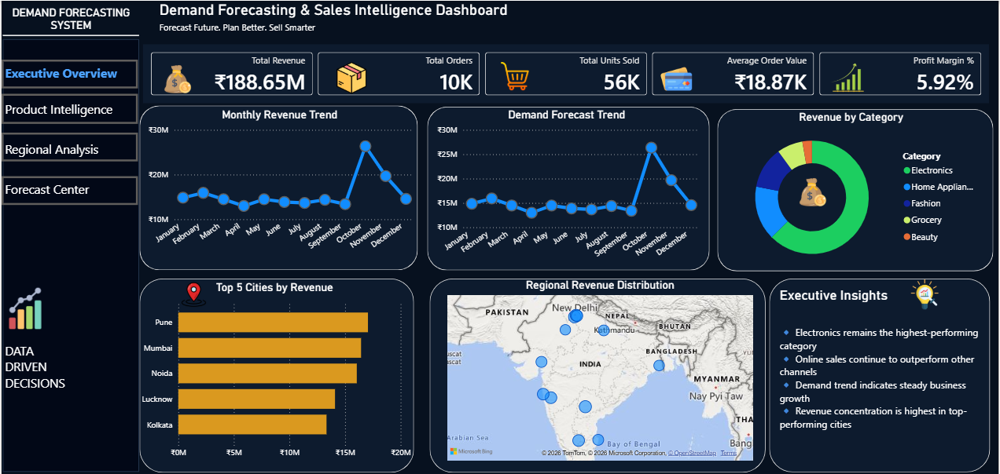
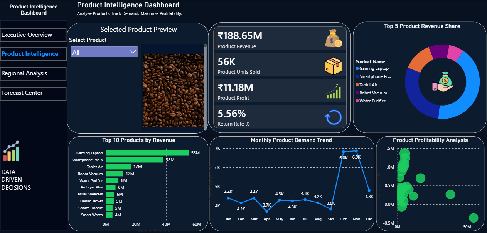
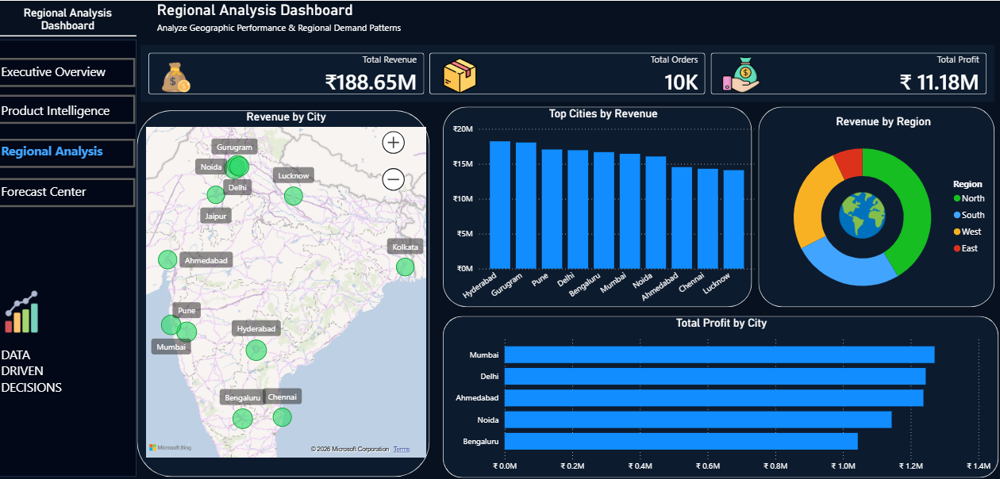
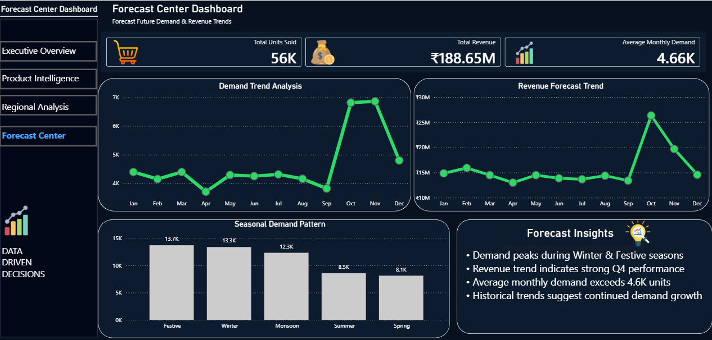

# Demand Forecasting & Sales Intelligence Dashboard

## Overview

This Power BI project focuses on sales performance analysis and demand forecasting to support data-driven business decisions.

## Dashboard Preview

### Executive Overview

### Product Intelligence

### Regional Analysis

### Demand Forecasting

---

## Key Features

- Executive Sales Overview
- Product Performance Analysis
- Regional Insights
- KPI Tracking
- Demand Forecasting
- Interactive Slicers and Filters

## Tools Used

- Power BI
- Power Query
- DAX
- Data Modeling

## Dataset

The dataset contains historical sales transactions, product information, regional performance data, and time-series records used for demand forecasting and business analysis.

## Business Questions Answered

- Which products generate the highest revenue?
- Which regions contribute the most to sales?
- How are sales trends changing over time?
- What is the expected future demand?

## Key Metrics

- Revenue
- Orders
- Profit
- Profit Margin
- Forecasted Demand

## Project Outcome

The dashboard provides a centralized view of business performance and helps identify trends, opportunities, and future demand patterns through interactive visualizations and forecasting techniques.
